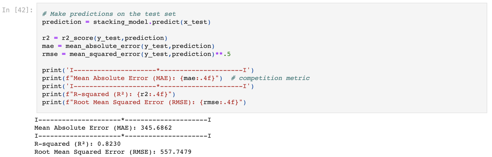

# Blueberry Yield Value Prediction Model Stacking
Yield prediction for blueberries. Tried bunch of manipulation techniques for well condition data.

## Kmeans 'Segment' Feature Creation

## Model Architecture 

## Results + MAE was the Competition Metric

