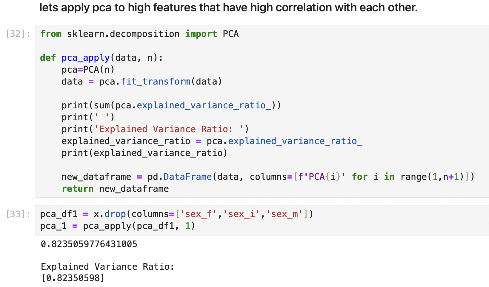
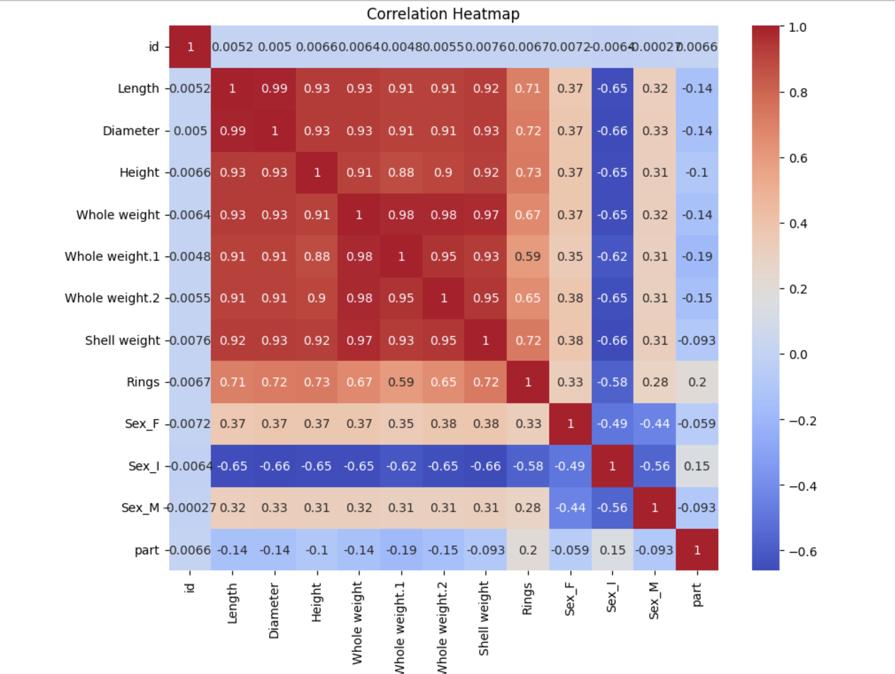
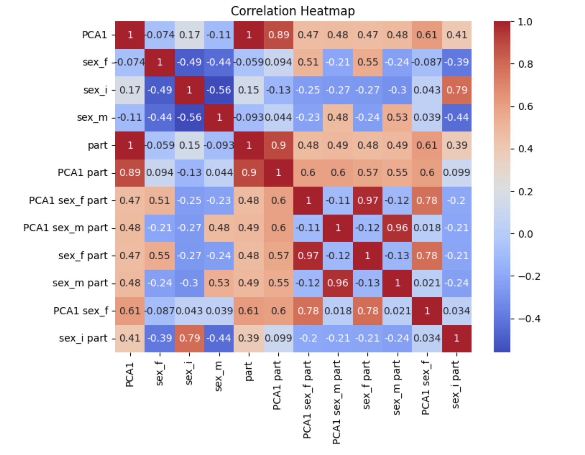

# Predicting Abalone Rings from Physical Measurements

This project aims to predict the number of rings on abalones using various physical measurements. By applying dimensionality reduction (PCA) and polynomial feature engineering, we strive to enhance model performance and uncover deeper insights into the data.

---

## Table of Contents

1. [Overview](#overview)  
2. [Key Steps](#key-steps)  
   - [1. Principal Component Analysis (PCA)](#pca)  
   - [2. Polynomial Features](#polynomial-features)  
   - [3. Correlation Analysis](#correlation-analysis)  
   - [4. Results](#results)  
3. [Conclusion](#conclusion)

---

## Overview

Abalone rings are commonly used as an indicator of age. However, predicting these rings from physical measurements can be challenging due to:
- **Multicollinearity:** Many features are highly correlated, complicating regression models.  
- **Non-Linear Relationships:** Simple linear models may fail to capture important interactions between features.

To address these challenges, we apply:
- **PCA** to reduce dimensionality and mitigate multicollinearity.  
- **Polynomial Features** to capture non-linear interactions that might improve predictive accuracy.

---

## Key Steps

### 1. Principal Component Analysis (PCA) 
We began by identifying features that were highly correlated. PCA was then used to reduce the dimensionality of these features, allowing us to capture the majority of the variance in fewer components.

---

### 2. Polynomial Features 
After applying PCA, we used **PolynomialFeatures** (from `sklearn.preprocessing`) to expand our feature set. This technique helps uncover non-linear relationships by creating interaction terms and higher-degree terms (e.g., squared or cubic features), depending on the specified degree.

*Parameters used:*

  -> interaction_only=True :  the transformer does not include squared or cubic terms of individual features (like x^2 or x^3).  It only includes cross-terms such as x1 * x2^2.

---

### 3. Correlation Analysis 
To track how effectively our transformations reduced multicollinearity, we compared correlation matrices before and after applying PCA and feature engineering.

**Initial Correlation Matrix**  

**Final Correlation Matrix**  

---

### 4. Results 
Below is an overview of the model’s performance after applying PCA and polynomial feature engineering:

---

## Conclusion

By combining PCA for dimensionality reduction with polynomial features to capture non-linear relationships, this project demonstrates a promising approach to predicting abalone rings. Reducing multicollinearity and adding interaction terms can lead to more robust and accurate models.

**Potential Next Steps**  
- Experiment with alternative dimensionality reduction methods or different numbers of PCA components.  
- Investigate other non-linear models (e.g., Random Forest) to compare performance.  
- Perform hyperparameter tuning to refine polynomial degree and reduce overfitting.

